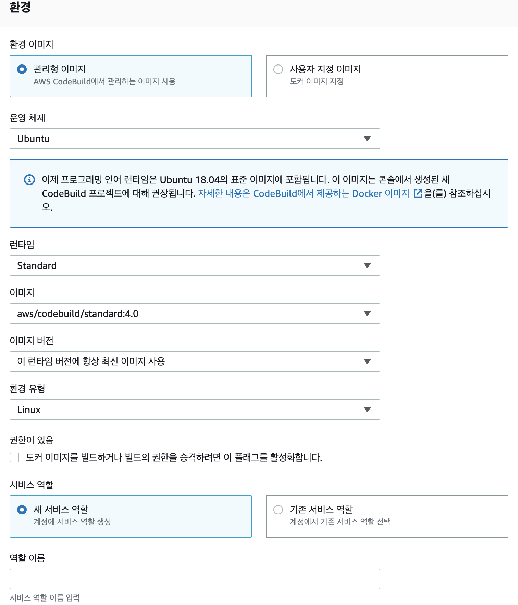

# AWS CodePipeLine + Codebuild, CodeDeploy

AWS의 배포 자동화 3형제 실제 사용해본 경험을 토대로 함으로 저의 한해서 정확합니다(다른 경우는 잘 모르겠습니다)

우선 각각의 역활을 먼저 살펴보고 자세한 동작에 대하여 알아보자.

`CodePipeline`은 말 그대로의 파이프라인의 역활을 한다.

> 어떠한 트리거나 동작에 의하여 실행되고 앞서 실행된 파일이나 결과를 다음으로 전달하여 동작시킬수 있다.

이러한 연결 연결을 만들어낼 수 있다.

`Codebuild`에 경우에는 코드빌더 즉 배포본의 build 역활을 담당한다.

> 흔히알고 있는 yaml 파일의 정의에 의한 CLI명령을 체계적으로 실행하는 Action instance이다.

이때 Artifact라는 결과물을 받아 저장하고 내보낼수 있는 압축본을 저장하는데 중요한 개념이니 알아보면 좋다.

`CodeDeploy`에 경우 자세한 배포환경 및 세팅을 할 수 있다.

> 인스턴스를 만들걱나 기존의 인스턴스에 서버를 끄고 다시 생성하고 실행하고 등의 일련의 재배포 및 신규 배포에 있어서 필요한 Action을 저장하여 사용한다.

## CodePipeLine

코드 파이프라인 부터 살펴보면 Sourece공급자를 통하여 전체 코드소스를 받을수 있는데 대부분의 코드 Manage 프로그램과 연결이 가능하다.

우리 코드는 github2를 통해서 받아낼 예정이다.

github에 경우에는 Plugin을 설치하면서 Repository에 접근 권한을 열어줄 수 있고, 본인의 소스코드가 있는 레포지토리를 선택해주자.

트리거로 동작할 브랜치까지 설정해주고나면 이제 **해당 브랜치에 코드가 병합(merge or push)된다면 트리거로서 PipeLine이 실행된다.**

이후에 빌드 공급자를 선택할 수 있고 그 후에 배포공급자를 선택할수 있다.

이 포스트에서는 빌드 공급자는 Codebuild를 배포 공급자는 필요의 경우 CodeDeploy를 사용한다.

## CodeBuild

코드빌드의 경우에는 기본적으로 빌드환경을 조성해줘야하는데

본인에게 익숙한 환경을 선택해 주면된다. 본 포스팅은 다음과 같은 환경을 따른다.



이렇게 본인의 편한 환경을 조성하고 `빌드스펙` 파일을 생성하여 브랜치에 함께 푸시하거나 직접 명령을 삽입하면 된다.

```yaml
# Buildspec.yml
version: 0.2

phases:
  install:
    commands:
      - npm install
  build:
    commands:
      - npm run build

artifacts:
  files:
    - "**/*"
cache:
  paths:
    - "node_modules/**/*"
```

이렇게 빌드 스팩을 만들어주면 모든 파일을 Artifacts로 만들어 다음 파이프라인으로 던져줄수 있다.

Cache를 이용하면 조금더 빠른 빌드를 할 수 있으니 참고하자

로그에 대한 설정은 `CloudWatch`를 통해 build가 일어났을 때의 instance에서 어떤 일이 일어나는지 직접 로그를 통해 확인할 수 있으니 필요시에 세팅하면 좋다.

서버의 경우에는 위와 같은 빌드 파일을 사용하였고, `Client`의 경우에는 S3에 정적 배포를 진행하였기에 바로 S3에 빌드본을 업로드하도록 하였는데 이것도 참고하도록 업로드하겠다

```yaml
version: 0.2

phases:
  install:
    commands:
      - npm install
  build:
    commands:
      - npm run build
      # - command
  post_build:
    commands:
      - ls -al
      - aws s3 cp --recursive build/ s3://{mybucket name}
```

이런식으로 S3에 Artifacts가 아닌 모든 build 파일을 업로드 하였다. Client는 이렇게하면 배포단계는 S3 Point만 지정해주면 끝나기에 편리하다.

하지만 서버는 Deploy가 필요했다.

## CodeDeploy

요건 배포를 위해 팔요한데 배포의 환경을 만들기 위해 필요하다.

Buildspec을 만들어 동작하는 build와 유사한데 다만 Appspec을 사용하여 instance환경에서 실행한다.

```yaml
# appspec.yml
version: 0.0

os: linux
files:
  - source: /
    destination: /home/ubuntu/build
hooks:
  BeforeInstall:
    - location: /init.sh
      runas: root
  ApplicationStart:
    - location: /start.sh
      runas: root
```

files를 통해 인스턴스에 파일을 가져올수 있고,

hooks를 통해 커멘드 스크립트언어를 실행 시킬수 있다.

```sh
# init.sh
#!/bin/bash
if [ -d "/home/ubuntu/build" ]; then rm -Rf "/home/ubuntu/build"; fi
```

기존의 있던 빌드파일을 지워줘서 환경을 초기화하고

```sh
# start.sh
export NVM_DIR="$HOME/.nvm"
[ -s "$NVM_DIR/nvm.sh" ] && \. "$NVM_DIR/nvm.sh"  # This loads nvm
[ -s "$NVM_DIR/bash_completion" ] && \. "$NVM_DIR/bash_completion"

pm2 delete all
ln -s /home/ubuntu/.env.production $PROJECT_ROOT

cd $PROJECT_ROOT

pm2 start npm -- run start:prod --name {appname}
```

나는 node server를 구동하기에 nvm을 불러와주고, pm2로 실행중이던 기존의 instance를 모두 종료해주고 다시 실행하는 것을 작업해주었다.
