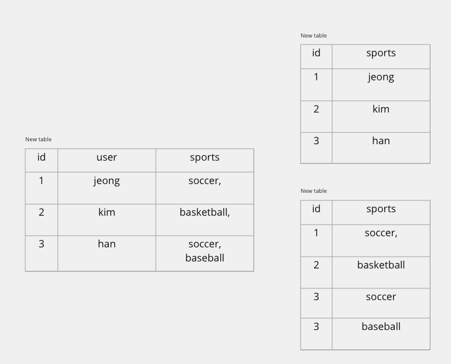
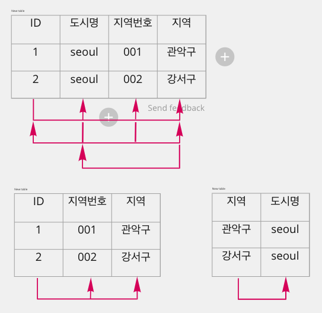

# DATABASE란? 

우리는 소프트웨어에서 반드시 어떠한 데이터를 다루게 되어 있다.

이러한 데이터를 비교적 관리가 쉽도록 만들어 사용하고 있고, 이러한 것을 DATABASE라고 한다.

이런 데이터 베이스는 크게 관계형, 비관계형으로 나뉜다.

## 데이터베이스의 특징

1. **데이터의 독립성**
   - 물리적 독립성 : 데이터베이스 사이즈를 늘리거나 성능 향상을 위해 데이터 파일을 늘리거나 새롭게 추가하더라도 관련된 응용 프로그램을 수정할 필요가 없다.
   - 논리적 독립성 : 데이터베이스는 논리적인 구조로 다양항 응용 프로그램의 논리적 요구를 만족시켜줄 수 있다.
2. **데이터의 무결성**
   - 여러 경로를 통해 잘못된 데이터가 발생하는 경우의 수를 방지하는 기능으로 데이터의 유효성 검사를 통해 데이터의 무결성을 구현하게 된다.
3. **데이터의 보안성** 
   -  인가된 사용자들만 데이터베이스나 데이터베이스 내의 자원에 접근할 수 있도록 계정 관리 또는 접근 권한을 설정함으로써 모든 데이터에 보안을 구현할 수 있다.
4. **데이터의 일관성**
   - 연관된 정보를 논리적은 구조로 관리함으로써 어떤 하나의 데이터만 변경했을 경우 발생할 수 있는 데이터의 불일치성을 배제할 수 있다. 또한 작업 중 일부 데이터만 변경되어 나머지 데이터와 일치하지 않는 경우의 수를 배제할 수 있다.
5. **데이터 중복 최소화** 
   - 데이터베이스는 데이터를 통합해서 관리함으로써 파일 시스템의 단점 중 하나인 자료의 중복과 데이터의 중복성 문제를 해결할 수 있다.

## ACID

**Atomicity** 원자성 하나의 트랜젝션 내에서는 모든 연산이 성공하거나 모두 실패해야 한다.

**Consistency** 일관성 데이터베이스 상태는 이전과 같이 유효해야 한다. 제약을 위반하지 않아야 한다.

**Isolation** 고립성 하나의 트랜잭션이 다른 트랜잭션은 독립적이여야 한다.

**Durability** 지속성 트랜잭션에 대한 로그 기록은 영구적이어야 한다.

## 정규화

데이터 베이스에 설계와 깊은 관련이 있다. 정규화는 데이터의 중복방지, 무결성을 충족시키기 위해 데이터베이스를 설계하는 것을 의미합니다.

목적은 갱신 이상을 피하기 위함이다.

**갱신 이상**의 종류

- **삽입 이상(insertion anomalies)** 원하지 않는 자료가 삽입된다든지, 삽입하는데 자료가 부족해 삽입이 되지 않아 발생하는 문제점을 말한다.

- **삭제 이상(deletion anomalies)** 하나의 자료만 삭제하고 싶지만, 그 자료가 포함된 튜플 전체가 삭제됨으로 원하지 않는 정보 손실이 발생하는 문제점을 말한다.

- **수정(갱신)이상(modification anomalies)** 정확하지 않거나 일부의 튜플만 갱신되어 정보가 모호해지거나 일관성이 없어져 정확한 정보 파악이 되지 않는 문제점을 말한다.

## 정규화 과정

1. **제1 정규화**
   -  테이블의 컬럼이 원자값(Atomic Value, 하나의 값)을 갖도록 테이블을 분해하는 것이다.

  

2. **제2 정규화**
   -  제1 정규화를 진행한 테이블에 대해 완전 함수 종속을 만족하도록 테이블을 분해하는 것이다. 여기서 완전 함수 종속이라는 것은 기본키의 부분집합이 결정자(unique)가 되어선 안된다는 것을 의미한다.

  

3. **제3 정규화**
   -  제2 정규화를 진행한 테이블에 대해 이행적 종속을 없애도록 테이블을 분해하는 것이다. 여기서 이행적 종속이라는 것은 A -> B, B -> C가 성립할 때 A -> C가 성립되는 것을 의미한다.

  

4. **BCNF 정규화**
   - 제3 정규화를 진행한 테이블에 대해 모든 결정자가 후보키가 되도록 테이블을 분해하는 것

  