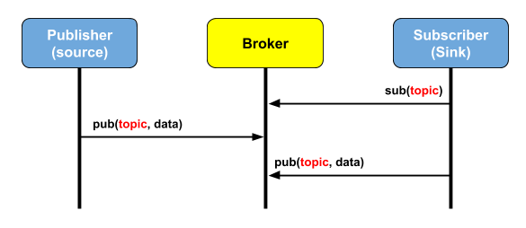

# MQTT

> MQTT(MQ Telemetry Transport)는 대기 시간이 길고 대역폭이 낮으며 신뢰성이 낮은 네트워크를 위해 설계된 경량 메시징 프로토콜입니다.

실직적으로 AMQP 와 MQTT는 유사한 동작을 한다. 어떤 것을 사용하는 것은 자유이지만 미세한 차이로 두 가지를 복합적으로 적절한 곳에서 사용하는 것이 좋을 수도 있다.

주로 IOT 시스템에서 사용하며 작은 코드 공간 제한된 대역폭에서 동작하기 위해 만들어졌다.

**TCP/IP 기반으로 동작**하지만 굉장히 가볍다. 어떠한 데이터도 주고 받을 수 있다.

_amqp와의 차이점을 알아보자_

- amqp보다는 보안성이 안 좋다.

- amqp는 Layer protocol이여서 확장성이 좋지만, MQTT는 그렇지 않다 새로운 버전을 출시 해야함

- 가볍게 동작한다.

- 불안정한 상황에서 더 잘 동작한다.

## Architecture

기본요소 `Publisher`, `Broker`, `Subscriber`가 있다.

Publisher는 메세지를 발행하고, Subscriber는 메세지를 구독합니다.

이러한 구조에서 가질 수 있는 장점을 알아보자.

1. **스페이스 디커플링** : `Publisher`와 `Subscriber`는 서로 알 필요가 없습니다(예를 들어, IP 주소와 포토의 교환은 없습니다).

2. **시간 디커플링** : `Publisher`와 `Subscriber`를 동시에 실행할 필요는 없습니다.

3. **동기화 디커플링** : publishing 또는 receiving 중에 두 구성 요소의 작업을 중단할 필요가 없습니다.

현재 Product 단에는 EMQX을 Broker 솔루션을 사용중

이러한 데이터는 **Topic**을 통해 전달되는데

**Broker**는 **Topic**에 따라서 메세지를 **Sub**에게 전달 한다

이러한 메세지 필터링을 **SUBJECT-BASED FILTERING**이라고 부른다.

이 밖에도 **CONTENT-BASED FILTERING, TYPE-BASED FILTERING**이 가능하다.
