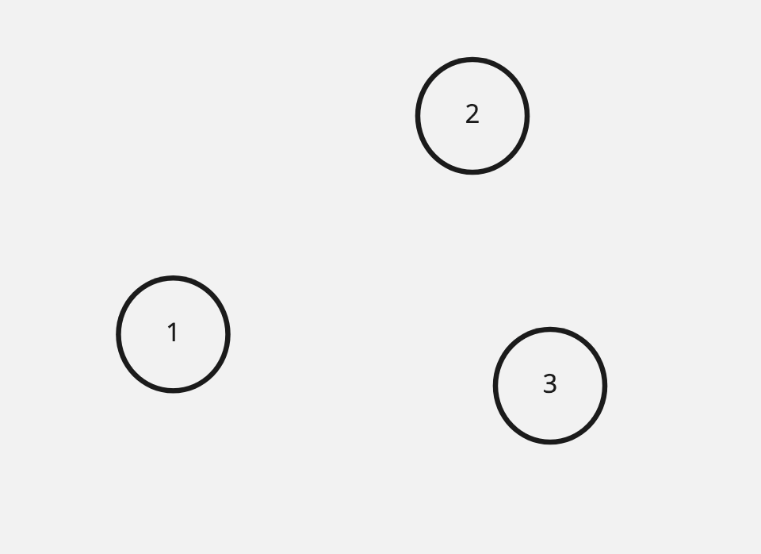
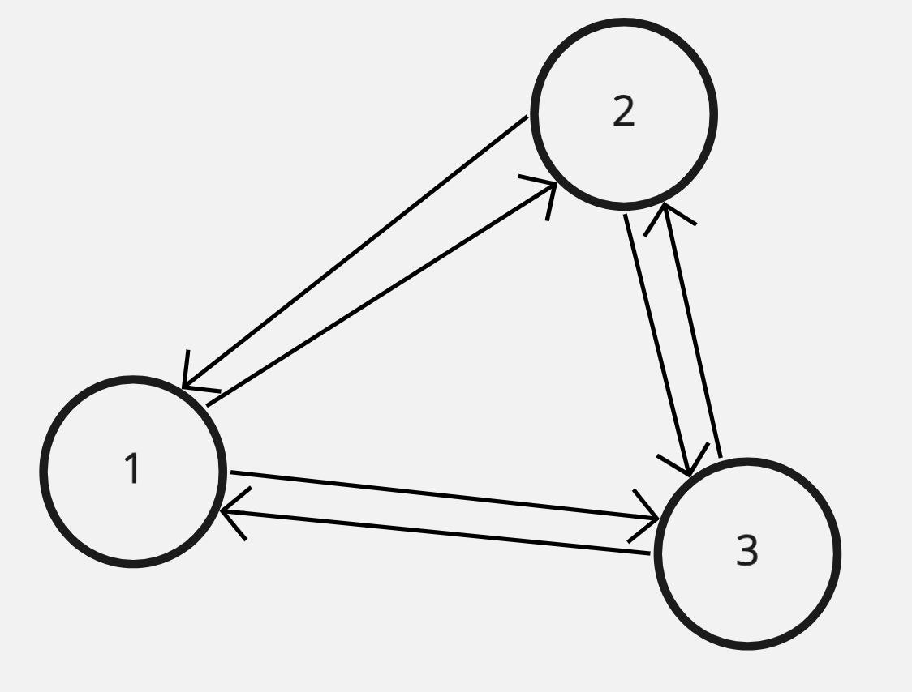
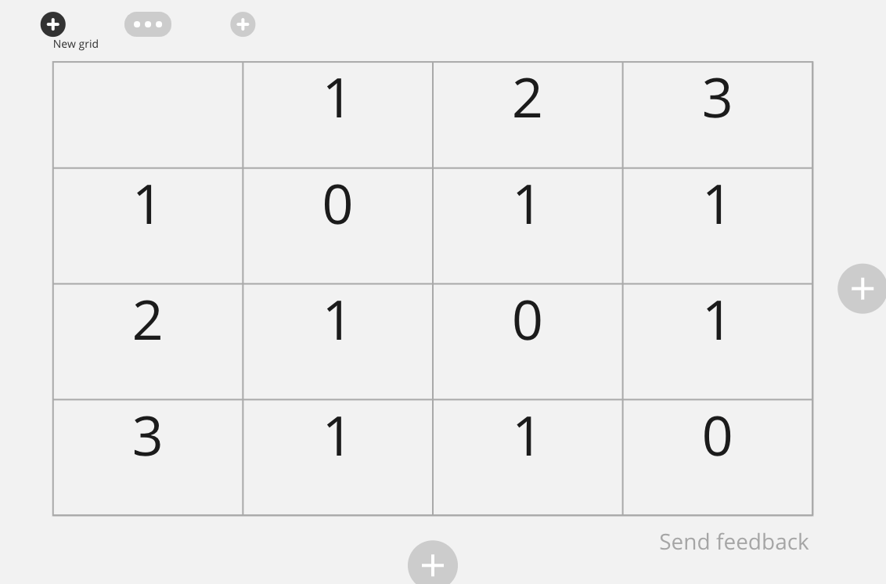
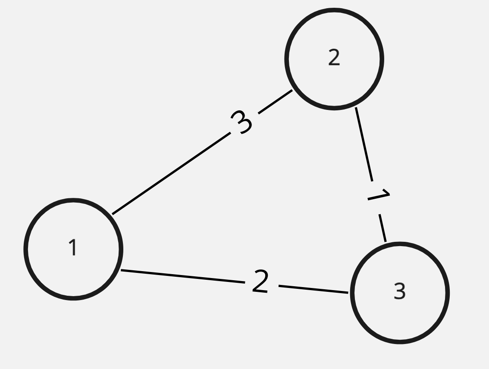
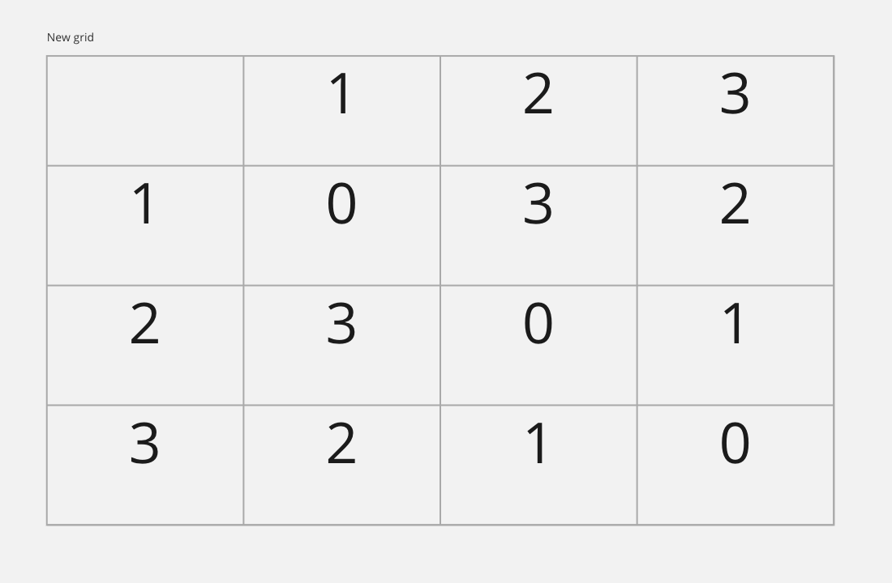
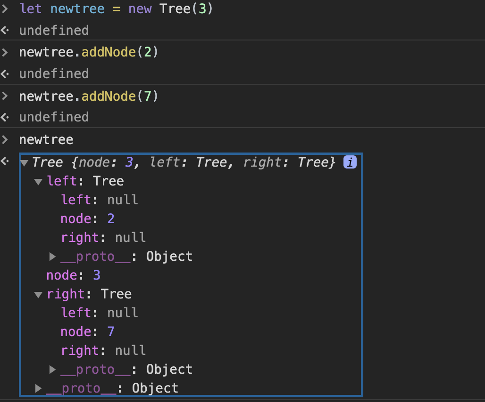

# node란?

우리는 node에 대하여 꾸준히 듣고는 한다. 컴퓨터 공학에서 말하는 node란 도대체 무엇일까?

node.js에 DOM에서 나왔던 node 자료구조의 node들 이러한 node들을 미루어보았을때 어떤 단위를 의미하는 것이라고 어렴풋이 느낄수 있다.

네트워크를 표현하기 위한 구조중 하나인 노드(node)는 네트워크망이 서로 뒤엉켜 연결된 모습을 점과 선으로 보여주는 도구로서 탄생하였다. 이중에 점의 역활을 하고 있는 것이 바로 (node)

- 한 개의 기능
- 한 개의 구조
- 한 개의 장치

이러한 구조적인 단위를 만들고, 기능들의 관계가 서로 유기적으로 선으로 표현이 가능한 구조들을 표현하기 위하여 네트워크 표현에서 발전하여 여러 분야에서 node와 선을 이용해 graph의 복잡한 구조를 설명하기 시작하였고, 특히 컴퓨터 공학에서 넓리 사용되게 되었다.

참고로 수학적으로는 1800년대에 등장하였고, 교점을 node라고 칭하기 시작하였으며, 초기에 네트워크 이론을 구성한 전기 회로이론에서 거론된 것이 최초이다.

## graph

이러한 node와 edge 들의 구조를 통해 우리는 컴퓨터의 자료구조를 표현할 수 있다는 것을 이해하였다.

node는 자료구조에서는 데이터나 기능을 의미할 것이고 edge는 데이터간의 연결이나, 관계를 표현한 것으로 이것을 그래프화 할 수 있다는 것인데 어떤 것이 있을지 생각해보자

자료 구조에서는 주로 유향 그래프와 Tree 구조를 다룬다. (이 두 가지가 자료구조를 표현하기에 적절하기에

### 유향 그래프( 방향이 있는 그래프)

해당 자료를 참고하였다. [https://kyungseop.tistory.com/17](https://kyungseop.tistory.com/17)

우리에게 1, 2 3 이라는 노드가 주어지고, 어떠한 규칙에 의해 이 노드들을 조회아여야한다고 생각해보자.

예) 가장 짧은 거리의 순서대로 방문한다. 등

이러한 각각의 edge(간선)에 가중치와 방향을 주어 해결 하게 된다.

이를 어떻게 할당하고 읽게 될까?

서로 연결된 간선을 통해 각각의 연결을 표현하면 이렇게 차트를 통해 표현할 수 있다.
이를 통해 시작을 1에서 시작하면 1 → 2 → 3

2에서는  2 → 1 → 3

3 에서는 3 → 1 → 2

여기에 가중치를 할당하여 순회 할 수 있도록 한다면.

이렇게 거리를 가중치라고 생각하고 노드들을 연결한다면 짧은 거리가 우선순위가 높다고 생각하고 조회 해보도록 하자.

1 : 1 → 3 → 2

2 : 2 → 3 → 1

3 : 3 → 2 → 1

이제 각 트리에 방향이 한 양방향이 아닐때 가중치가 서로 다를때는 어떻게 동작할지 고민해보자.

우리는 js code로 이러한 노드 그래프를 표현 할 수 있는데 어떻게 효율적으로 구현 가능할까?

그렇다면 node Tree란 무엇 일까?

# node tree 구조 이해

node tree는 부모 자식의 관계를 분명하게 가지는 node graph이다.

- tree에서 최상위노드인 root node를 가지게 된다.
- 부모 노드에서 자식 노드로 갈라지게 된다.
- 부모는 0개 이상의 자식을 가진다. 이 자식 노드들 끼리는 서로가 형제 노드가 된다.
- 그 자식 노드도 0개 이상의 자식 노드를 가진다. 이러한 구조를 반복하게 된다.

위 그림은 2진 트리의 구조를 시각화 한 것이다.

## 2진 tree

트리구조에서 자식노드가 0개에서 2개 이하로 정해진  트리구조를 가진다.

어떠한 트리구조를 2진 트리구조로 치환하는 것이 가능한데, 이것은 다음에 다루겠다.

모든 트리구조는 2진 tree로 만들어 질 수 있다고 하였으니 우리는

2진 tree 구조를 잘 만들 수 있어야한다. 어떻게 만들어질까?

1. root node를 정한다.
2. 새로운 생성된 노드와 root node와의 관계를 탐색하여서 자식 노드로서 위치(L, R)를 결정한다.
3. 새로운 노드가 생성되면  2를 반복한다.
4. root node의 자식 2개가 채워졌다면 조건을 탐색을 하위 노드를 진행할 때마다 시행한다.
5. 비어 있는 자식 노드에 노드를 채운다.
6. 이러한 과정을 반복한다.

2진 node tree를 만들어보자.

해당 Tree의 값을 만들어 넣어 보자.

트리 구조를 만들었다. 한 번 그림으로 그려보자.

이런 식으로 생성 된다 이제 이것을 BFS, DFS로 탐색할 수 있는데 이 부분에 대해서는 나중에 알아보자

나중에 알아보려 했지만 조금만 알아보자
