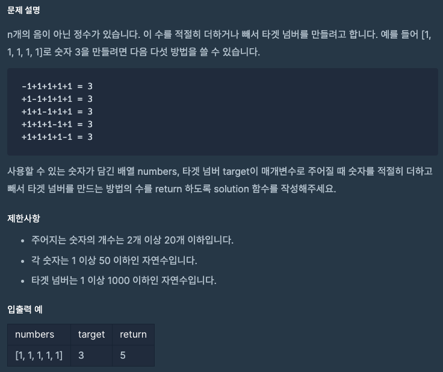

## bfs

해당 로직은 프로그래머스의 깊이/너비 우선 탐색(DFS/BFS) 문제인 타겟 넘버 문제의 풀이에 대한 설명으로 해당 문제를 먼저 시도해 본 뒤에 포스팅을 참고하자.



위 문제는 bfs나 dfs 방식으로 접근하여 문제를 해결할 수 있다.

모든 경우의 수를 확인할때 bfs dfs 접근 방식은 매우 유용하게 사용할 수 있다.

위 문제는 +/- 두가지 방향성이라고 생각하고 tree 구조의 Bfs/Dfs를 구현한다는 생각으로 접근하였다.

```go
func solution(numbers []int, target int) int {
    var count int
    var recurDFS func(int, int, int) // func 내부에서 선언된 func의 재귀를 위해선 반드시 선언을 우선해 줘야한다.
    // 내부 func 스코프에서 재귀 호출을 위해서 관련 내용이 궁금하다면 https://ichi.pro/ko/go-eseo-jungcheob-doen-jaegwi-hamsu-jagseong-56318922925811 참고하자
    visit := make([]bool, len(numbers) + 1)
    
    recurDFS = func(number int, idx int, sum int) {
        sum += number
        visit[idx] = true // 해당 노드 방문 여부 갱신
        
        if idx == len(numbers) {
            if sum == target {
                count++ // 타겟과 전체 합이 같다면 count 증가
                return
            } else {
                return
            }
        }

        if !visit[idx + 1] {
            recurDFS(numbers[idx] * -1, idx + 1, sum) // 재귀 호출
            visit = make([]bool, len(numbers) + 1)
            recurDFS(numbers[idx], idx + 1, sum) // 재귀 호출
        }
        
    }
    
    recurDFS(0, 0, 0) // 시작은 0 에서 시작한다

    return count
}
```

위에 코드는 DFS 접근방법으로 재귀적 호출을 이용한 방법이다.


```go
type Tree struct {
    Val int
    Index int
    Left *Tree
    Right *Tree
}

func (t *Tree) AddLeft(val int, idx int) {
    t.Left = &Tree{Val:val}
    t.Left.Index = idx
}

func (t *Tree) AddRight(val int, idx int) {
    t.Right = &Tree{Val:val}
    t.Right.Index = idx
}

func (t *Tree) BFS( numbers[]int, target int) int {
    var count int
    queue := []*Tree{t}
    
     for len(queue) > 0 {
         var tree *Tree
         tree, queue = queue[0], queue[1:]
 
         if tree.Index == len(numbers) && tree.Val == target {
             count++
         }
         if tree.Index < len(numbers) {
             tree.AddRight((numbers[tree.Index] * -1) + tree.Val, tree.Index + 1)
             tree.AddLeft(numbers[tree.Index] + tree.Val, tree.Index + 1)
            
             queue = append(queue, tree.Right, tree.Left)   
         }
     }
    return count
}


func solution(numbers []int, target int) int {
    var tree *Tree
    tree = &Tree{Val: 0, Index:0}
    return tree.BFS(numbers, target)
}
```

위는 바이너리 트리를 적용한 BFS 방법으로 queue를 직접 배열로 선언한 뒤에 작업을 순차적으로 탐색할 수 있도록 수행하였다.

