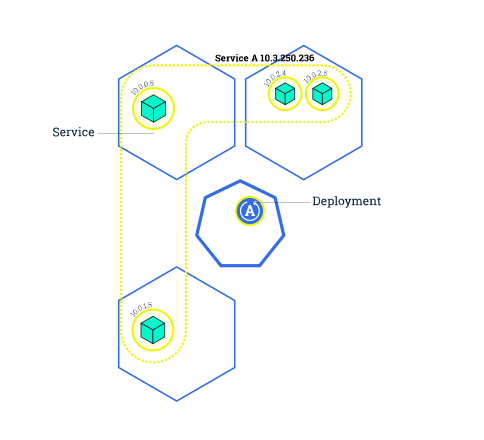

# Rolling update

**Rolling update를 통해 Pod instance를 새 instance로 점진적으로 업데이트하여 어플리케이션의 Down 없이 무중단 배포를 할 수 있다.**

> 기본적으로 Rolling Update 중에는 하나의 Pod를 사용할 수 없고 새로 1개의 Pod가 생성된다.




Scaling과 유사하게 동작하며 배포가 공개적(publicly)으로 노출되면, **서비스는 업데이트 중에 사용 가능한 Pod로만 트래픽을 로드 밸런싱한다.**

Rolling Update를 통해 가능한 것

- 컨테이너 이미지 업데이트를 통해 어블리케이션의 Promote(증진)
- 이전 버전으로 Rollback
- 다운타임 없이 애플리케이션의 지속적 통합 및 지속적 전달 (무중단 배포)
  
1. 현재 상태부터 확인하자

```bash
$ kubectl get deployments

NAME                  READY   UP-TO-DATE   AVAILABLE   AGE
kubernetes-bootcamp   0/4     0            0           8s
```

```bash
$ kubectl get pods

NAME                                  READY   STATUS    RESTARTS   AGE
kubernetes-bootcamp-fb5c67579-2s5qf   1/1     Running   0          105s
kubernetes-bootcamp-fb5c67579-58hxp   1/1     Running   0          105s
kubernetes-bootcamp-fb5c67579-gpj95   1/1     Running   0          105s
kubernetes-bootcamp-fb5c67579-pzwf2   1/1     Running   0          105s
```

```bash
$ kubectl describe pods

...
Image:          gcr.io/google-samples/kubernetes-bootcamp:v1
Image ID:       docker-pullable://jocatalin/kubernetes-bootcamp@sha256:0d6b8ee63bb57c5f5b6156f446b3bc3b3c143d233037f3a2f00e279c8fcc64af
...
...
Image:          gcr.io/google-samples/kubernetes-bootcamp:v1
Image ID:       docker-pullable://jocatalin/kubernetes-bootcamp@sha256:0d6b8ee63bb57c5f5b6156f446b3bc3b3c143d233037f3a2f00e279c8fcc64af
...

```

2. 이제 버전을 업데이트 해보자

```bash
$ kubectl set image deployments/kubernetes-bootcamp kubernetes-bootcamp=jocatalin/kubernet-bootcamp:v2

deployment.apps/kubernetes-bootcamp image updated
```

업데이트와 동시에 Rolling update는 시작되었다.

3. 새 Pod를 확인하고 이전 Pod를 확인해보자.

```bash
$ kubectl get pods

NAME                                   READY   STATUS        RESTARTS   AGE
kubernetes-bootcamp-7d44784b7c-7gw8j   1/1     Running       0          81s
kubernetes-bootcamp-7d44784b7c-h9gq5   0/1     Terminating   0          6m20s
kubernetes-bootcamp-7d44784b7c-n5tf6   0/1     Terminating   0          6m21s
kubernetes-bootcamp-7d44784b7c-xg5sg   0/1     Terminating   0          6m22s
kubernetes-bootcamp-fb5c67579-2s5qf    0/1     Terminating   0          6m22s
```

시간이 흐른 뒤에 다시 명령어를 입력하면

```bash
$ kubectl get pods

NAME                                   READY   STATUS    RESTARTS   AGE
kubernetes-bootcamp-7d44784b7c-7gw8j   1/1     Running   0          4m42s
kubernetes-bootcamp-7d44784b7c-h9gq5   1/1     Running   0          4m35s
kubernetes-bootcamp-7d44784b7c-n5tf6   1/1     Running   0          4m36s
kubernetes-bootcamp-7d44784b7c-xg5sg   1/1     Running   0          4m43s
```

4. Service 에 노출된 PORT를 확인하자

```bsah
$ kubectl describe services/kubernetes-bootcamp

Name:                     kubernetes-bootcamp
Namespace:                default
Labels:                   app=kubernetes-bootcamp
Annotations:              <none>
Selector:                 app=kubernetes-bootcamp
Type:                     NodePort
IP Families:              <none>
IP:                       10.104.210.114
IPs:                      10.104.210.114
Port:                     <unset>  8080/TCP
TargetPort:               8080/TCP
NodePort:                 <unset>  30433/TCP
Endpoints:                172.18.0.10:8080,172.18.0.11:8080,172.18.0.12:8080 + 1 more...
Session Affinity:         None
External Traffic Policy:  Cluster
Events:                   <none>
```
