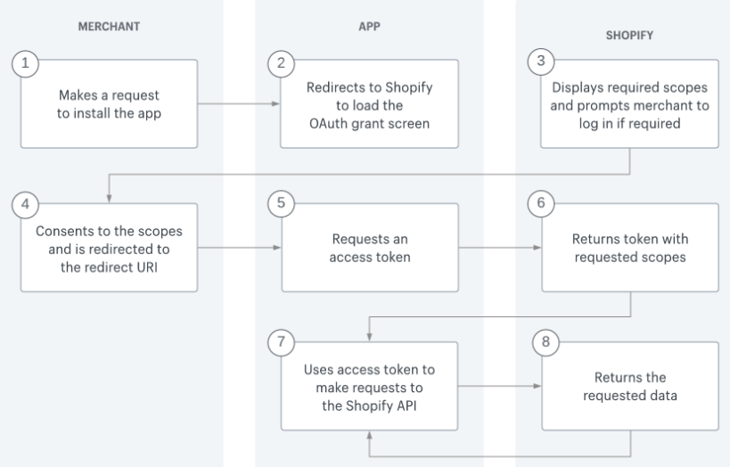

# Oauth

nestjs에서 shopify Oauth 인증 구현

퍼블릭 엡에서 사용할 인증 방법을 구현했던 것을 기록하기 위한 내용이다.

현재 우리의 엡은 Shopify Oauth를 이용하여 AccessToken을 받고 Shopify API를 이용한다.

기본적인 구조는 여타 서비스들의 Oauth 과정과 같다.



1. Makes a reqest to install app

```ts
isInstalledShop(targetShop: string, res: Response) {
    targetShop = targetShop.toString();

    return res.redirect(
      302,
      `${process.env.HOST}/auth/shopify/install?shop=${targetShop}`,
    );
  }
```

우리는 인스톨 버튼이나 shop(store) 정보를 입력받아 그대로 install end point로 라우트 시킨다.

```ts
callInstall(targetShop: string) {
    targetShop = targetShop.toString();
    if (
      targetShop.split(':')[0] === 'http' ||
      targetShop.split(':')[0] === 'https'
    ) {
      targetShop = targetShop.split(':')[1].slice(2);
    }

    const { scope, callbackURL, clientID } = this.configShopify;

    const query = {
      scope: Array.isArray(scope) ? scope.join(',') : scope,
      state: randomBytes(16).toString('hex'),
      redirect_uri: callbackURL,
      client_id: clientID,
    };

    let makeurl = format({
      pathname: '/admin/oauth/authorize',
      hostname: targetShop.endsWith('.myshopify.com')
        ? targetShop
        : `${targetShop}.myshopify.com`,
      protocol: 'https',
      query,
    });
    makeurl += `&grant_options[]=value`;
    this.logger.debug('makeURL', makeurl);
    return makeurl;
  }
```

인스톨 페이지로 이동할 수 있도록 인스톨 페이지 URL을 만들어 클라이언트로 전달하였다.
클라이언트에서는 이것을 받아서 리다이렉트 시킨다.

2. OAouth grant screen

shopify 화면에서 로그인 진행 및 권한을 부여할 것인지 선택하는 화면이나온다.

권한을 수락하고, 인스톨을 진행한다.

3. install URI에 포함되었던, Redirect_URI로 리다이렉트된다.

이때 shopify에서는 `query string`을 통해서 다음과 같은 정보를 함께 전달한다.

```ts
  @query hmac : string
  @query code : string
  @query state : string
  @query host : string
  @query shop : string
  @query timestamp : string
```

우리는 이중에서 code를 이용하여서 `AccessToken`을 받아볼 수 있다.
hmac에 대한 부분은 [여기를 살펴보자](https://shopify.dev/apps/auth/oauth#verification)

```ts
authRedirect(redirectinputDto: RedirectinputDto) {
    const shopifyToken = new ShopifyToken();
    if (!shopifyToken.verifyHmac(redirectinputDto)) {
      this.logger.debug(
        '[OauthCallback] verifyHmac query: %O',
        redirectinputDto,
      );
      throw new UnauthorizedException('unauthorized');
    }

    this.logger.debug(
      `authRedirect redirectinputDto`,
      redirectinputDto.shop.split('.')[0],
    );

    const res = await axios.post<AccessToken>(
      `https://${redirectinputDto.shop}/admin/oauth/access_token`,
      {
        client_id: this.configShopify.clientID,
        client_secret: this.configShopify.clientSecret,
        code: redirectinputDto.code,
      },
    );

    if (!res.data) {
      this.logger.error(
        `Check Client_id, Client_secret, Code:
        ${this.configShopify.clientID},
        ${this.configShopify.clientSecret},
        ${redirectinputDto.code}.`,
      );
      throw new BadRequestException(`Check Client_id, Client_secret, Code`);
    }

    const allRes = await
      this.updateOrCreateAccessToken(redirectinputDto.shop, res.data)
    return allRes
```
