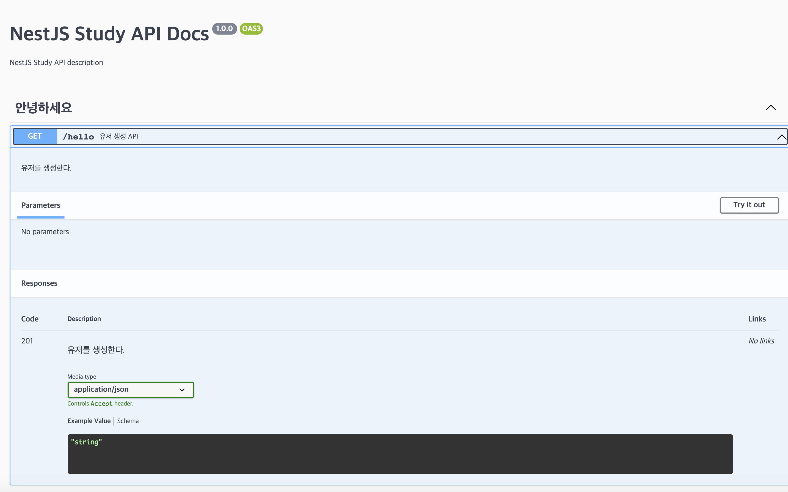

# Swagger

새로운 회사에 입사하고 나니 스웨거라는 것이 프로젝트에 적용되어 있었다.

어떤 기능을 하는지 알아보자, 우선적으로 깃북이나 포스트맨과 같은 API 테스트 및 문서화를 위한 도구라고 느껴졌다.

간단하게 공식 홈페이지를 살펴보자

1. API Design

2. API Build

3. API Document

4. API Test

5. API Standardize

이런 기능들을 가지고 있는 것이 스웨거의 특징이라고 소개한다.

오 모든 API를 작성하고 만들고 보완하는 기능을 한번에 제공해주는 것 같다. 포스트맨도 사실 대부분 지원해 주는 기능이니 그렇게 놀랍지는 않은건가..?

하지만 스웨거를 사용하는 대표적인 이유는 따로 있는데, 자동으로 API 문서를 만들어 주는 것이다.

포스트맨 또한 API디자인을 하면 문서로 출력할 수 있지만, 그건 포스트맨을 이용하여 디자인된 API만으로 한정된다.

하지만 스웨거는 라이브러리를 설치하고 문법에 맞게만 작성하면 알어서 내가 작성한 코드를 파악하고 API문서를 볼 수 있게 해준다.

**대박!!**

그럼 테스트를 해보자

나는 현재 프로젝트를 위해 검토중인 nest.js를 이용하여 백엔드 작성에 함께 이용해보도록 하겠다.

네스트에 대한 자세한 설명은 제외하고 네스트 스웨거 모듈을 설치하고, 몇 가지 매소드를 적어주기만 하면

```ts
import { Controller, Get } from "@nestjs/common";
import { ApiCreatedResponse, ApiOperation, ApiTags } from "@nestjs/swagger";
import { AppService } from "./app.service";

@Controller("hello")
@ApiTags("안녕하세요")
export class AppController {
  constructor(private readonly appService: AppService) {}

  @Get()
  @ApiOperation({ summary: "유저 생성 API", description: "유저를 생성한다." })
  @ApiCreatedResponse({ description: "유저를 생성한다.", type: String })
  getHello(): string {
    return this.appService.getHello();
  }
}
```



이런 결과를 얻을수가 있는데 스웨거의 API 문서 자동완성 기능을 통해 볼 수 있는 페이지 모습이다.

이러한 페이지는 공유도 가능하기에 이 자체를 API Document로서 사용하는 것은 문서를 따로 작성하는 수고를 줄여준다.
